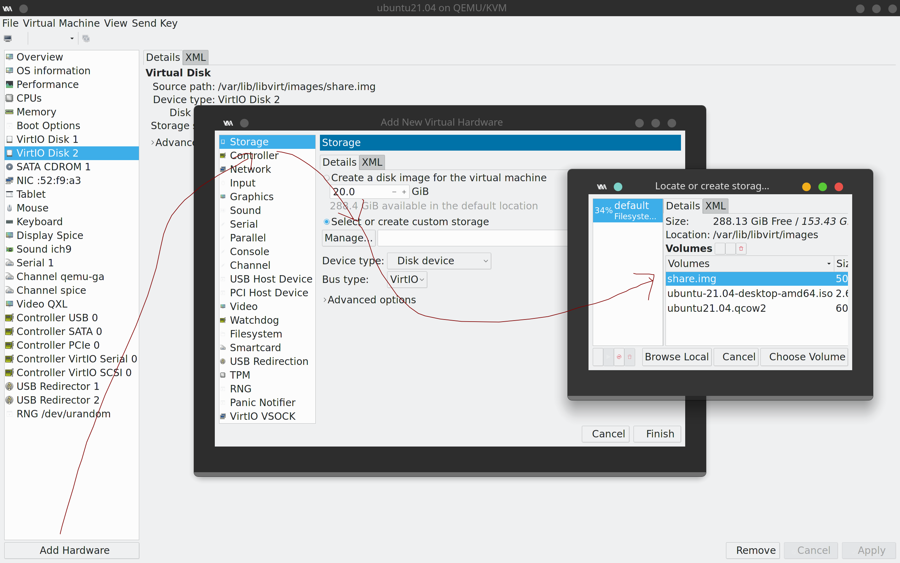

# Arch configurations and problems

记录过程，遇到类似问题可以参考。

- [Arch configurations and problems](#arch-configurations-and-problems)
  - [参考](#参考)
  - [system config](#system-config)
    - [vim plugin configuration](#vim-plugin-configuration)
    - [docker](#docker)
    - [golang](#golang)
    - [anaconda](#anaconda)
    - [jetbrains-toolbox](#jetbrains-toolbox)
    - [TIM](#tim)
    - [vscode](#vscode)
    - [fcitx](#fcitx)
    - [bluetooth](#bluetooth)
    - [zsh](#zsh)
    - [页面大小配置](#页面大小配置)
    - [groovy 配置](#groovy-配置)
    - [konsole 快捷键配置](#konsole-快捷键配置)
    - [flameshot 快捷键配置](#flameshot-快捷键配置)
    - [grub2 主题配置](#grub2-主题配置)
    - [回收站配置](#回收站配置)
    - [virt-manager 共享文件夹设置](#virt-manager-共享文件夹设置)
  - [小技巧](#小技巧)
    - [图形界面切换](#图形界面切换)
  - [Q&A](#qa)
    - [efi 启动分区丢失](#efi-启动分区丢失)
    - [代理问题](#代理问题)
    - [virt-manager 虚拟机启动失败](#virt-manager-虚拟机启动失败)
    - [emoji 编码问题部分解决](#emoji-编码问题部分解决)
    - [kde-applications 显示没有后端](#kde-applications-显示没有后端)
    - [pdf 中文乱码](#pdf-中文乱码)
    - [vim 中文乱码](#vim-中文乱码)
    - [vim 和剪辑板不共通](#vim-和剪辑板不共通)
    - [vscode 无法登录](#vscode-无法登录)
    - [git](#git)
  - [记一次重装系统](#记一次重装系统)
    - [硬件准备](#硬件准备)
    - [参考资料](#参考资料)
    - [联网](#联网)
    - [设置时区](#设置时区)
    - [磁盘分区、格式化、文件系统挂载](#磁盘分区格式化文件系统挂载)
    - [配置软件仓库镜像](#配置软件仓库镜像)
    - [安装系统](#安装系统)
    - [进入 chroot](#进入-chroot)
    - [设置系统](#设置系统)
    - [配置用户](#配置用户)
    - [配置启动加载器](#配置启动加载器)
    - [设置图形用户界面](#设置图形用户界面)
    - [收尾](#收尾)

## 参考

- [ArchLinuxTutorial](https://archlinuxstudio.github.io/ArchLinuxTutorial/#/)

## system config

已安装的软件列表。

- google-chrome
- typora
- tmux
- iwd
- fcitx
- vscode
- yay
- TIM
- timeshift
- flameshot
- jetbrains-toolbox
- baidunetdisk
- wps
- docker
- netease-cloud-music
- Visual Paradigm
- insomnia
- node, nvm
- vue
- java
- maven
- gradle
- anaconda
- cmake
- go
- wechat
- yarn
- simplescreenrecorder
- firefox
- tree
- doctoc
- unrar
- easyconnect
- virt-manager
- bomi
- scala, sbt
- alsa-utils
- kwin-tiling

### vim plugin configuration

安装插件管理器 vim-plug：

```shell
curl -fLo ~/.vim/autoload/plug.vim --create-dirs https://raw.githubusercontent.com/junegunn/vim-plug/master/plug.vim
```

插件列表：

```txt
call plug#begin('~/.vim/plugged')
Plug 'Raimondi/delimitMate'
Plug 'prabirshrestha/asyncomplete.vim'
Plug 'prabirshrestha/vim-lsp'
Plug 'prabirshrestha/asyncomplete-lsp.vim'
Plug 'mattn/vim-lsp-settings'
# 文件目录
Plug 'preservim/nerdtree'
# 模糊查找
Plug 'Yggdroot/LeaderF', { 'do': './install.sh' }
call plug#end()
```

### docker

安装：

```shell
sudo pacman -S docker docker-compose
```

启动`docker`服务：

```shell
sudo systemctl enable docker.service
sudo systemctl start docker.service
```

并且添加自己到`docker`用户组

```shell
usermod -aG docker <me>
```

配置存储驱动程序。

向`/etc/docker/daemon.json`中写入：

```shell
{
  "storage-driver": "overlay2"
}
```

### golang

`go`还是蛮好装的。

按照官网上的来：

```shell
rm -rf /usr/local/go && tar -C /usr/local -xzf go1.16.3.linux-amd64.tar.gz
export PATH=$PATH:/usr/local/go/bin
```

后边那句写到`.zshrc`就行。

### anaconda

设置开机不自启动：

```shell
conda config --set auto_activate_base false
```

配置镜像，把下边这段粘帖到`～/.condarc`:

```shell
channels:
  - defaults
show_channel_urls: true
default_channels:
  - https://mirrors.tuna.tsinghua.edu.cn/anaconda/pkgs/main
  - https://mirrors.tuna.tsinghua.edu.cn/anaconda/pkgs/r
  - https://mirrors.tuna.tsinghua.edu.cn/anaconda/pkgs/msys2
custom_channels:
  conda-forge: https://mirrors.tuna.tsinghua.edu.cn/anaconda/cloud
  msys2: https://mirrors.tuna.tsinghua.edu.cn/anaconda/cloud
  bioconda: https://mirrors.tuna.tsinghua.edu.cn/anaconda/cloud
  menpo: https://mirrors.tuna.tsinghua.edu.cn/anaconda/cloud
  pytorch: https://mirrors.tuna.tsinghua.edu.cn/anaconda/cloud
  simpleitk: https://mirrors.tuna.tsinghua.edu.cn/anaconda/cloud
```

### jetbrains-toolbox

需要安装`fuse`依赖:

```shell
sudo pacman -S fuse
```

它其实就是一个可执行文件，所以直接放到`/opt`就行。

### TIM

一开始报了很多依赖错误，后来发现，`pacman`的仓库没有完全解锁。

把`/etc/pacman.conf`中这段注释去掉。

```shell
[multilib]
Include = /etc/pacman.d/mirrorlist
```

然后同步软件仓库。

```shell
sudo pacman -Syyu
```

最后直接安装即可：

```shell
yay -S com.qq.tim.spark
```

### vscode

侧边栏字体大小配置，配置窗口整体放大倍数：

```shell
settings.json
{
    "window.zoomLevel": 1,
    "editor.fontSize": 15,
}
```

### fcitx

中文输入法配置。

安装之后再装一些模块就好。

```shell
sudo pacman -S fcitx
sudo pacman -S fcitx-cloudpinyin
sudo pacman -S kcm-fcitx
sudo pacman -S kimtoy
sudo pacman -S vim-fcitx
```

解决终端以及一些系统应用下没法使用中文的问题：

在`/etc/profile`中加入：

```shell
export XIM_PROGRAM=fcitx
export XIM=fcitx
export GTK_IM_MODULE=fcitx
export QT_IM_MODULE=fcitx
export XMODIFIERS="@im=fcitx"
```

### bluetooth

蓝牙配置。

```shell
sudo pacman -S pulseaudio-bluetooth
sudo pacman -S bluez-utils
sudo vim /etc/bluetooth/main.conf
```

添加自动启动配置：

```shell
[Policy]
AutoEnable=true
```

别忘了启动服务：

```shell
sudo systemctl enable bluetooth.service
```

### zsh

zsh插件配置。

`zsh-syntax-hightlighting`，命令高亮。

```shell
git clone https://github.com/zsh-users/zsh-syntax-highlighting.git ${ZSH_CUSTOM:-~/.oh-my-zsh/custom}/plugins/zsh-syntax-highlighting
```

`autosuggestions`，记住你之前使用过的命令

```shell
git clone git://github.com/zsh-users/zsh-autosuggestions ~/.oh-my-zsh/custom/plugins/zsh-autosuggestions
```

而后启动插件，编辑`~/.zshrc`文件，添加这句话：

```shell
plugins=(git zsh-syntax-highlighting zsh-autosuggestions sudo extract)
```

添加或者修改，原本的 `.zshrc` 里边可能已经有了部分配置。

`sudo`，`extract`是`oh-my-zsh`自带的，前者按两下`esc`命令行首添加`sudo`，后者一键解压神器。

### 页面大小配置

`kde`系统设置中配置。

`System Settings` > `Display and Monitor` > `Display Configuration`

调整`Global scale`至合适大小，我目前电脑舒适值是175。

### groovy 配置

下载官方包`groovy-3.0.7`

解压至`/usr/lib/gdk`，`gdk`是我自己创建的文件夹

创建符号链接`default`指向`groovy-3.0.7`

> 模仿`pacman`安装`jdk`的方法

关于`/usr/lib`等文件夹的用途可参见`man hier`

有个问题：使用`sudo pacman -S groovy`下载的`groovy`在`/usr/share/groovy`中

这里我不知道需不需要也复制一份

### konsole 快捷键配置

说是配置，其实也就是默认，感觉用着还行。

- `new tab`: `ctrl + shift + t`
- `split view lift/right`: `ctrl + (`
- `split view top/bottom`: `ctrl + )`

### flameshot 快捷键配置

设置快捷键启动的方式：

设置 -> 快捷键 -> 自定义快捷键 -> 编辑 -> 新建 -> 全局快捷键 -> 命令/URL

设置触发器：设置为`ctrl + alt + s` -> 动作：命令/URL填：`/usr/bin/flameshot gui`

### grub2 主题配置

下载喜欢的主题，解压直接运行里边的`install.sh`就行。

### 回收站配置

将`rm`删除的文件存放在一个文件夹里，每周定时清空文件夹。

创建回收站文件夹并写一个`safe_rm.sh`脚本:

```shell
trash="$HOME/.trash"

for i in $*
do
  stamp=`date +"%Y-%m-%d_%H:%M:%S"`
  file="$(basename $i)"
  mv $i ${trash}/${file}.${stamp}
done
```

在`.zshrc`中设置`rm`别名：

```shell
alias rm="bash $sys/sh/safe_rm.sh"
```

设置`crontab`任务，每周一凌晨4点清空回收站。

```shell
0 4 * * 1 rm -rf /home/xiayi/.trash/*
```

### virt-manager 共享文件夹设置

先使用 dd 创建一个文件并格式化：

```bash
dd if=/dev/zero of=/var/lib/libvirt/images/share.img bs=1M count=500
mkfs.ext4 /var/lib/libvirt/images/share.img
```

而后在宿主机上创建文件夹并以此挂载刚刚的文件：

```shell
mkdir ~/Mine/share
mount -o loop /var/lib/libvirt/images/share.img ~/Mine/share
```

在 virt-manager 中挂载这块磁盘：



最后在虚拟机中挂载它即可，一般来说是 /dev/vd*。

## 小技巧

### 图形界面切换

使用`ctrl + alt + fn + f2`切换到`tty2`，然后 kill 掉占内存大的程序。

使用`ctrl + alt + fn + f1`切回到图形界面，也就是`tty1`。

## Q&A

### efi 启动分区丢失

安装在移动硬盘上的系统在硬盘拔出后会丢失`bios`启动选项。

此时需要用刻入`iso`的启动盘重新安装。

`mount`及之前的步骤必须全部做完，同时，`pacstrap`一步必须保证`/mnt/boot`内`.img`等文件安装完整。简单说就是一定要做`pacstarp /mnt base linux linux-firmware`。

其余包已经安装好，不用重新下载。

`arch-chroot`后，`grub-install`和`grub-mkconfig`步骤也须小心谨慎，尤其是后者，不能只出现两行提示，一定要确保出现`found...`。

---

`2021.04.27`更新：

首先，`bios`启动分区丢失应该是电脑关机后还没断电的时候把移动硬盘拔出了。

但是我在网上搜了很久也没有找到关机和断电的关系，或许以后会继续更新。

然后，丢失后其实需要做的只有两次`mount`，一次`swapon`，然后`chroot`，然后`grub-install`，`grub-mkconfig`。

在`mkconfig`的时候只要确认找到一些必要的内核文件等什么的就行。

### 代理问题

clash 突然不能用了。

原因没有确定，个人 clash 配置没有出问题，只有可能是系统出问题了。

目前有 3 种解决方案：

1. 仍然用 clash，且使用系统代理。在设置代理端口的时候，用最下边的设置方式 `Use manually ...` 而不是直接设置系统代理。kde 的系统设置就是个玩具。
2. 仍然用 clash，且不用系统代理。那么改用 firefox，在 setting 中设置个性化代理方式。
3. 不用 clash，使用 v2rayA。具体见其[官方 wiki](https://github.com/v2rayA/v2rayA/wiki/%E4%BD%BF%E7%94%A8%E6%96%B9%E6%B3%95#user-content-%E5%AE%89%E8%A3%85%E5%AE%8C%E6%AF%95%E5%90%8E%E5%A6%82%E4%BD%95%E4%BD%BF%E7%94%A8)。这种配置是透明代理。

如果想手动配置透明代理看[这个教程](https://guide.v2fly.org/#%E5%A3%B0%E6%98%8E)。

### virt-manager 虚拟机启动失败

具体原因可以看[这篇帖子](https://www.xmodulo.com/network-default-is-not-active.html)，解决方法可以看[这篇帖子](https://www.jianshu.com/p/5af449e07c11)。

就是 default 网络没有启动，这个网络是用于连接宿主机和虚拟机的。其实具体我也不是很清楚。

简而言之就是启动 default 网络并设置自动启动。

还有，更新内核后需要重新启动电脑，否则会报错 `unable to open /dev/net/tun`。

### emoji 编码问题部分解决

参考了[这篇文章](https://ld246.com/article/1581074244078)。

安装字体包，这个看 arch 官网的教程，把一堆包全装上。

在`~/.fonts`下创建文件`75-noto-color-emoji.conf`。如果没有文件夹则创建个。

为什么在这个文件夹内创建呢，因为我看系统管理字体的软链接文件都来自`/usr/share/fontconfig/conf.default/`，出于稳定性考虑我不应该改这个文件夹下的东西。

文件内容是：

```xml
<?xml version="1.0" encoding="UTF-8"?>
<!DOCTYPE fontconfig SYSTEM "fonts.dtd">
<fontconfig>

    <!-- Add generic family. -->
    <match target="pattern">
        <test qual="any" name="family"><string>emoji</string></test>
        <edit name="family" mode="assign" binding="same"><string>Noto Color Emoji</string></edit>
    </match>

    <!-- This adds Noto Color Emoji as a final fallback font for the default font families. -->
    <match target="pattern">
        <test name="family"><string>sans</string></test>
        <edit name="family" mode="append"><string>Noto Color Emoji</string></edit>
    </match>

    <match target="pattern">
        <test name="family"><string>serif</string></test>
        <edit name="family" mode="append"><string>Noto Color Emoji</string></edit>
    </match>

    <match target="pattern">
        <test name="family"><string>sans-serif</string></test>
        <edit name="family" mode="append"><string>Noto Color Emoji</string></edit>
    </match>

    <match target="pattern">
        <test name="family"><string>monospace</string></test>
        <edit name="family" mode="append"><string>Noto Color Emoji</string></edit>
    </match>

    <!-- Block Symbola from the list of fallback fonts. -->
    <selectfont>
        <rejectfont>
            <pattern>
                <patelt name="family">
                    <string>Symbola</string>
                </patelt>
            </pattern>
        </rejectfont>
    </selectfont>

    <!-- Use Noto Color Emoji when other popular fonts are being specifically requested. -->
    <match target="pattern">
        <test qual="any" name="family"><string>Apple Color Emoji</string></test>
        <edit name="family" mode="assign" binding="same"><string>Noto Color Emoji</string></edit>
    </match>

    <match target="pattern">
        <test qual="any" name="family"><string>Segoe UI Emoji</string></test>
        <edit name="family" mode="assign" binding="same"><string>Noto Color Emoji</string></edit>
    </match>

    <match target="pattern">
        <test qual="any" name="family"><string>Segoe UI Symbol</string></test>
        <edit name="family" mode="assign" binding="same"><string>Noto Color Emoji</string></edit>
    </match>

    <match target="pattern">
        <test qual="any" name="family"><string>Android Emoji</string></test>
        <edit name="family" mode="assign" binding="same"><string>Noto Color Emoji</string></edit>
    </match>

    <match target="pattern">
        <test qual="any" name="family"><string>Twitter Color Emoji</string></test>
        <edit name="family" mode="assign" binding="same"><string>Noto Color Emoji</string></edit>
    </match>

    <match target="pattern">
        <test qual="any" name="family"><string>Twemoji</string></test>
        <edit name="family" mode="assign" binding="same"><string>Noto Color Emoji</string></edit>
    </match>

    <match target="pattern">
        <test qual="any" name="family"><string>Twemoji Mozilla</string></test>
        <edit name="family" mode="assign" binding="same"><string>Noto Color Emoji</string></edit>
    </match>

    <match target="pattern">
        <test qual="any" name="family"><string>TwemojiMozilla</string></test>
        <edit name="family" mode="assign" binding="same"><string>Noto Color Emoji</string></edit>
    </match>

    <match target="pattern">
        <test qual="any" name="family"><string>EmojiTwo</string></test>
        <edit name="family" mode="assign" binding="same"><string>Noto Color Emoji</string></edit>
    </match>

    <match target="pattern">
        <test qual="any" name="family"><string>Emoji Two</string></test>
        <edit name="family" mode="assign" binding="same"><string>Noto Color Emoji</string></edit>
    </match>

    <match target="pattern">
        <test qual="any" name="family"><string>EmojiSymbols</string></test>
        <edit name="family" mode="assign" binding="same"><string>Noto Color Emoji</string></edit>
    </match>

    <match target="pattern">
        <test qual="any" name="family"><string>Symbola</string></test>
        <edit name="family" mode="assign" binding="same"><string>Noto Color Emoji</string></edit>
    </match>

</fontconfig>
```

而后建立软链接：

```shell
sudo ln -s ~/.fonts/75-noto-color-emoji.conf /etc/fonts/conf.d/
```

重启即可。

### kde-applications 显示没有后端

安装一个包：

```shell
sudo pacman -S packagekit-qt5
```

### pdf 中文乱码

`okular`默认配置中文乱码。

通过以下命令解决：

```shell
sudo pacman -S poppler-data
```

### vim 中文乱码

在`.vimrc`中加入：

```shell
set encoding = utf-8
```

### vim 和剪辑板不共通

删掉`vim`，装`gvim`

```shell
sudo pacman -S gvim
```

### vscode 无法登录

报错：

```shell
Writing login information to the keychain failed with error 'The name org.freedesktop.secrets was not provided by any .service files'.
```

原回答网址在[这里](https://rtfm.co.ua/en/linux-the-nextcloud-client-qtkeychain-and-the-the-name-org-freedesktop-secrets-was-not-provided-by-any-service-files-error/)。

简而言之，下载以下两个包：

```shell
yay -S qtkeychain gnome-keyring
```

通过以下两个命令来验证是否真的存在：

```shell
ls -l /usr/share/dbus-1/services/ | grep secret
cat /usr/share/dbus-1/services/org.freedesktop.secrets.service
```

### git

`git`报错无法打开`vi`。

设置`git`全局编辑器为`vim`:

```shell
git config --global core.editor vim
```

## 记一次重装系统

给`/usr`文件夹来了个递归的`chmod -R 775 /usr`。

不愧是我。

### 硬件准备

刻录`iso`的u盘，空的移动硬盘，可以查资料的电子设备。

### 参考资料

- [一个dalao的博客](https://blog.yoitsu.moe/arch-linux/installing_arch_linux_for_complete_newbies.html)；
- [官方文档](https://wiki.archlinux.org/index.php/Installation_guide_(%E7%AE%80%E4%BD%93%E4%B8%AD%E6%96%87))；
- czg的文档。

### 联网

先使用`ip link`判断网卡有没有通电。

如果是`down`，使用下列两条命令尝试开启网卡：

```shell
rfkill unblock all
ip link set wlan0 up
```

一般这样就可以了，如果不行就等一会。

如果实在不行，我目前也不知道这么解决。

有一次就是卡在这里，明明`ip link`还是`down`，但是网卡其实已经能用了...

 使用`iwd`扫描网络：

```shell
iwctl
device list
station <device> scan
station <device> get-networks
station <device> connect <network>
```

如果是有密码的WIFI，那就输入密码。

但我使用的是学校校园网，所以得手动登录。

用`curl`登录，具体命令如下：

```shell
curl 'http://p.nju.edu.cn/api/portal/v1/login' \
-H 'Connection: keep-alive' \
--data-raw '{"domain": "default", "username": "my_username", "password": "my_password"}'
```

上边的命令是直接从开发者工具扒下来的。

最后验证网已经通了：

```shell
ping www.baidu.com
```

### 设置时区

```shell
timedatectl set-local-rtc 1 --adjust-system-clock
timedatectl set-timezone Asia/Shanghai
timedatecal set-ntp true
```

### 磁盘分区、格式化、文件系统挂载

我以前分好过一次，所以这次重装不用再分区，只是把`/dev/sda3`格式化了一边。

`/dev/sda2`也就是交换分区，`/dev/sda1`也就是启动分区完全没有动。

如果需要重新分区的话，用`fdisk`分区即可，分区标准参照官方文档。

格式化同上。

挂载需要注意一个顺序问题。先挂载`linux root`分区，再在里边创建`/boot`文件夹挂载启动分区。

```shell
mount /dev/sda3 /mnt
mkdir /mnt/boot
mount /dev/sda1 /mnt/boot
swapon /dev/sda2
```

### 配置软件仓库镜像

就是把中国地区的镜像提到文件最开始。

```shell
vim /etc/pacman.d/mirrorlist
```

当然也可以自己后加，镜像网址还是很好找的。

别忘了刷新软件包仓库。

```shell
pacman -Syy
```

### 安装系统

通过`pacstrap`脚本安装基本软件包。

参考czg的文档，这一步安装了不少软件包。

```shell
pacstrap /mnt base linux linux-frimware f2fs-tools vim man-db man-pages texinfo sof-firmware alsa-ucm-conf refind zsh base-devel plasma kde-system konsole dolphin pkgstats fwupd mlocate git e2fsprogs iwd
```

这里边大部分是我用不到的好像。

如果这里不安装`iwd`，重启后就用不了了。

### 进入 chroot

先生成`fstab`文件，定义磁盘挂载。

```shell
genfstab -U /mnt >> /mnt/etc/fstab
```

进入`chroot`环境。

```shell
arch-chroot /mnt
```

此时相当于进入到`root`用户了。

### 设置系统

设置时区。

```shell
ln -sf /usr/share/zoneinfo/Asia/Shanghai /etc/localtime
```

运行`hwclock`生成`/etc/adjtime`。

```shell
hwclock --systohc
```

本地化设置。

需要设置`locale.gen`和`locale.conf`这两个文件。

编辑`/etc/locale.gen`在对应地区前移除注释符号。

我移除的是：

```shell
en_US.UTF-8 UTF-8
en_GB.UTF-8 UTF-8
zh_CN.UTF-8 UTF-8
zh_TW.UTF-8 UTF-8
```

通过`locale-gen`来生成locale的信息：

```shell
locale-gen
```

创建`locale.conf`文件编辑`LANG`设置：

```shell
echo "LANG=en_GB.UTF-8" >> /etc/locale.conf
```

用`GB`不用`US`是因为在保证`tty`不乱码，系统日志以英文显示的同时，以24小时制显示时间。具体好处参见官方文档。

设置网络。

创建`/etc/hostname`文件。

```shell
echo "${your_hostname}" >> /etc/hostname
```

添加对应的信息到`/etc/hosts`，这部分看官方文档就好。

同时，启动`networkmanager`和`iwd`的服务。

```shell
systemctl enable NetworkManager
systemctl enable iwd
```

>下面配置`DNS`的步骤不是必要的，甚至可以说，如果不是出现问题，最好别配置。

`DNS`解码不知道会不会出问题。我装系统的时候曾出现没装完就`reboot`的情况，重启之后无法解析域名，必须手动配置`DNS`服务器。

`google`的`DNS`服务器是`8.8.8.8`。

```shell
echo "nameserver 8.8.8.8 >> /etc/resolv.conf"
```

其实还可以看看`iso`系统下的`/etc/resolv.conf`是怎么配置的。

### 配置用户

设置`root`密码的部分略过。

调整`sudo`的配置，给予`wheel`用户组`root`权限：

```shell
EDITOR=vim visudo
```

在里边把以`# %wheel`开头的行首的`#`去掉即可，至于要不要密码看自己选择。

之后再添加一个`wheel`用户组的用户即可，也就是主用户。

### 配置启动加载器

最重要的一步。

首先得先装几个小软件包。别忘了刷新软件包数据库。

```shell
pacman -S efibootmgr dosfstools grub os-prober
```

然后安装`grub`：

```shell
grub-install --target=x86_64-efi --efi-directory=/boot --bootloader-id=GRUB
```

然后生成配置文件：

```shell
grub-mkconfig -o /boot/grub/grub.cfg
```

出现几个`found`就差不多了。

### 设置图形用户界面

如果不想要`gui`已经可以退出`chroot`然后重启了。

需要的话，首先安装基础包：

```shell
pacman -S xorg
```

选择全部默认就行。

然后安装自己喜欢的桌面，我选择的是`kde`相对熟悉一点。

```shell
pacman -S sddm kde-applications
```

然后安装中文字体，这个一定要安装否则会乱码。

```shell
pacman -S wqy-microhei wqy-zenhei
pacman -S adobe-source-han-sans-otc-fonts
pacman -S noto-fonts noto-fonts-cjk noto-fonts-emoji
```

### 收尾

到这里就可以退出`chroot`模式然后重启了。

但是有独显的电脑需要安装独立显卡驱动，这个我还不太懂。
